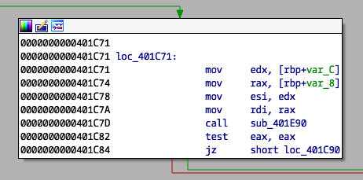

## Unknown (Reverse Engineering, 200pt)

> Diggin through some old files we discovered this binary. Although despite our inspection we can't figure out what it does. Or what it wants...
> 
> unknown - md5: 9f08f6e8240d4a0e098c4065c5737ca6

For this challenge we are given a 64bit ELF [binary](unknown).

```
❯❯❯ file unknown
unknown: ELF 64-bit LSB executable, x86-64, version 1 (SYSV), dynamically linked (uses shared libs), for GNU/Linux 2.6.32, stripped
```

The `main` function decompiles to the following:

```c
signed __int64 __fastcall main(int a1, char **a2, char **a3)
{
  signed __int64 result; // rax
  unsigned int i; // [rsp+14h] [rbp-Ch]
  char *v5; // [rsp+18h] [rbp-8h]

  if ( a1 == 2 )
  {
    if ( strlen(a2[1]) == 0x38 )
    {
      v5 = a2[1];
      for ( i = 0; i < 0x38; ++i )
      {
        if ( (unsigned int)sub_401E90((__int64)v5, i) )
          dword_603084 = 1;
      }
      if ( dword_603084 )
        puts("Nope.");
      else
        printf("Congraz the flag is: %s\n", v5, a2);
      result = 0LL;
    }
    else
    {
      puts("Still nope.");
      result = 4294967294LL;
    }
  }
  else
  {
    puts("Try again.");
    result = 0xFFFFFFFFLL;
  }
  return result;
}
```

Without further reversing I initially decided to use `angr` to solve this, so I wrote the following script:

```python
import angr
import claripy

flag_len = 57
find = (0x401CB7,)
avoid = (0x401CAB, 0x401C4B, 0x401C17,)

def main():
    proj = angr.Project('./unknown', load_options={"auto_load_libs": False})

    argv1 = claripy.BVS("argv1", flag_len * 8)
    initial_state = proj.factory.entry_state(args=["./unknown", argv1])#, add_options={angr.options.LAZY_SOLVES})

    for byte in argv1.chop(8):
        initial_state.add_constraints(byte != '\x00') # null
        initial_state.add_constraints(byte >= ' ') # '\x20'
        initial_state.add_constraints(byte <= '~') # '\x7e'

    initial_state.add_constraints(argv1.chop(8)[0] == 'T')
    initial_state.add_constraints(argv1.chop(8)[1] == 'U')
    initial_state.add_constraints(argv1.chop(8)[2] == 'C')
    initial_state.add_constraints(argv1.chop(8)[3] == 'T')
    initial_state.add_constraints(argv1.chop(8)[4] == 'F')
    initial_state.add_constraints(argv1.chop(8)[5] == '{')

    sm = proj.factory.simulation_manager(initial_state)
    sm.explore(find=find, avoid=avoid)

    solution = sm.found[0].solver.eval(argv1, cast_to=str)
    return solution

if __name__ == '__main__':
    print main()
```

I let the script run and went into other challenges. However, after a few hours it seemed like either I was missing something or `angr` was too inefficient for this (still not sure what was the case).

So, I adandoned this approach and started reversing the binary again. The binary checks each of the 56 chars of the flag against the `sub_401E90` function. If the character at position is correct, `EAX` is set to `0` otherwise `EAX` is set to `1`.

The corresponding code is shown below:



We can easily put a breakpoint @ `0x401C82` and bruteforce the flag one character at a time. While IDAPython could be used to accomplish that, I decided to use the rather simple interface of Radare2.

```python
import sys
import string
import r2pipe

flag = ["*"]*56

charset = string.digits + string.uppercase + string.lowercase + "{}_!"

def continue_to_index(i):
    for x in range(i):
        r2.cmd("dc")

for flag_index in range(len(flag)):
    for c in charset:
        r2 = r2pipe.open("unknown")
        flag[flag_index] = c
        r2.cmd('doo "{}"'.format("".join(flag)))
        r2.cmd("db 0x401C82")
        continue_to_index(flag_index+1)
        rax = int(r2.cmd("dr rax"), 16)
        r2.quit()
        if rax == 0:
            sys.stdout.write("\r"+"".join(flag))
            sys.stdout.flush()
            break

# TUCTF{w3lc0m3_70_7uc7f_4nd_7h4nk_y0u_f0r_p4r71c1p471n6!}
```
