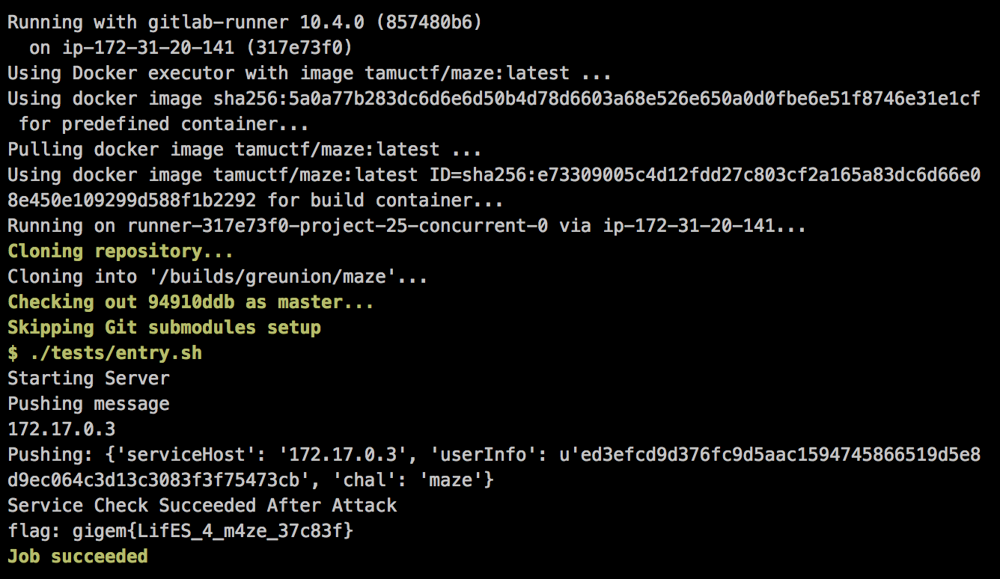

## maze (Secure Coding/Config, 100pt)

> I created this really cool CTF challenge where users are supposed to bypass client side authentication to get a flag. However it seems like people are able get the flag through other means!
> Can you find and fix the problem in my challenge for me?
> 
> [](https://gitlab.ctf.tamu.edu/root/maze)

You can find the unpatched source code in the [maze](maze/) folder.


#### Vulnerability

Path traversal through unsanitized `request.url`.


#### Patch

Use [`path.normalize`](https://millermedeiros.github.io/mdoc/examples/node_api/doc/path.html#path.normalize) to properly sanitize `request.url`.

```diff
diff --git a/server/server.js b/server/server.js
index 8798017..54356a0 100755
--- a/server/server.js
+++ b/server/server.js
@@ -29,7 +29,7 @@ app.get('/exit', function(request, response) {
 app.get('/*', function(request, response){
     console.log('request starting...');

-    var filePath = __dirname + '/..' +request.url;
+    var filePath = __dirname + '/..' +path.normalize(request.url);
     if (filePath == __dirname)
         filePath = __dirname + '/../public/index.html';
     var extname = path.extname(filePath);
```


#### Flag


