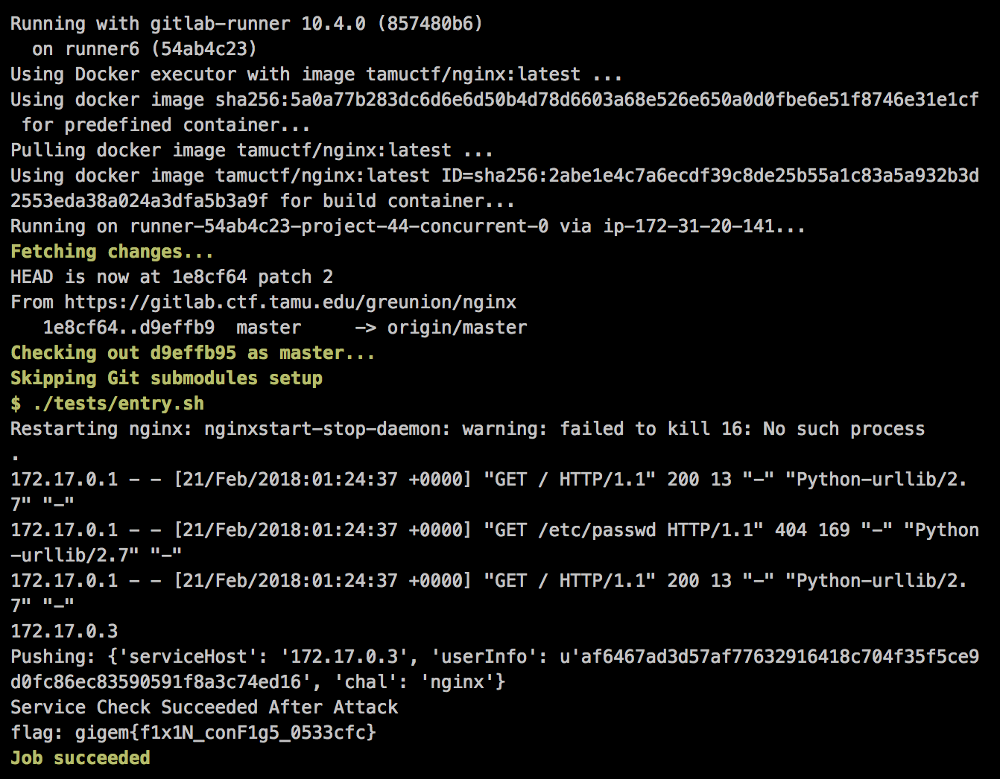

## nginx (Secure Coding/Config, 25pt)

> My friend set up a web server using nginx but he keeps complaining that people are finding files that they are not supposed to be able to get to. Can you fix his configuration file for him?
> 
> [](https://gitlab.ctf.tamu.edu/root/nginx)

You can find the unpatched source code in the [nginx](nginx/) folder.


#### Vulnerability

The `root` directive in the configuration allowed full filesystem enumeration.


#### Patch

Restrict the `root` of the web application to a proper *webroot* folder.

```diff
diff --git a/default b/default
index 60d20ca..6bc8568 100644
--- a/default
+++ b/default
@@ -33,7 +33,7 @@ server {
        #
        # include snippets/snakeoil.conf;

-       root /;
+       root /usr/share/nginx/html/;

        # Add index.php to the list if you are using PHP
        index index.html index.htm index.nginx-debian.html;
@@ -42,7 +42,7 @@ server {

        location / {
         try_files $uri $uri/ =404;
-        index /usr/share/nginx/html/index.html;
+        index index.html;
         autoindex on;
        }
```


#### Flag


