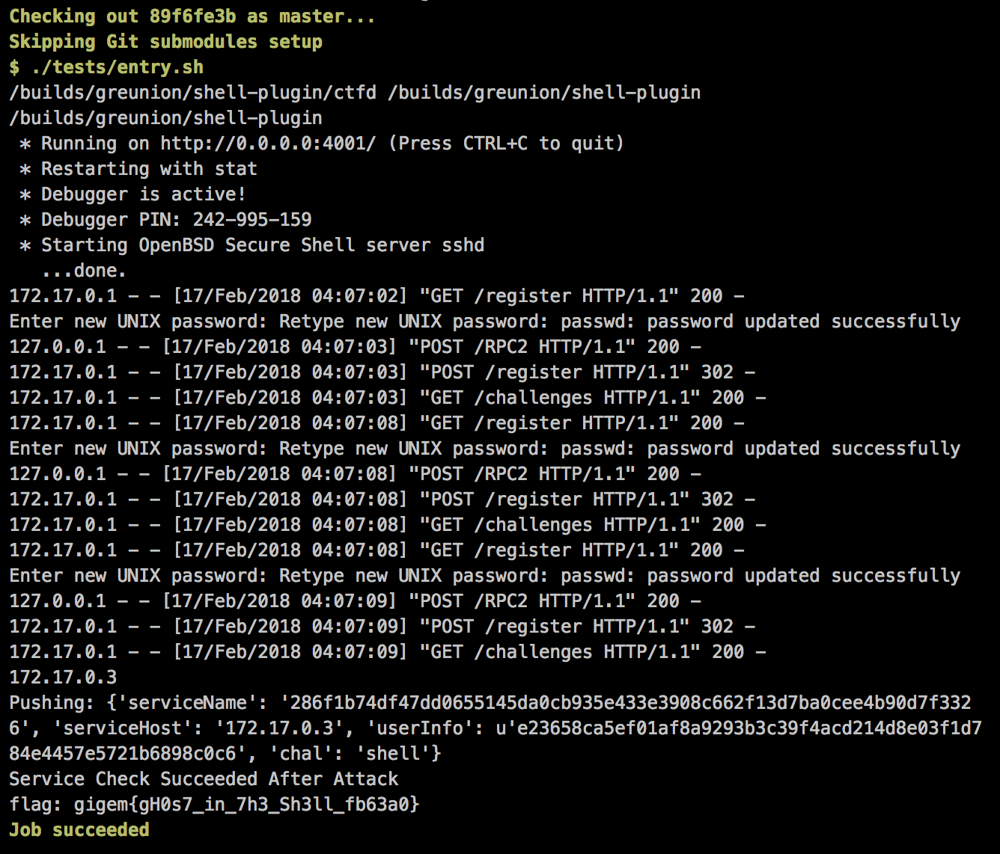

## shell-plugin (Secure Coding/Config, 200pt)

> I'm running a CTF competition that is geared towards newer students. I know that most of the students don't have easy access to a linux machine so why not give students shell access to my server so that they can use it to solve challenges?
> 
> In order to make this a reality I wrote this cool plugin for CTFd to automatically create an account when they register for the competition.
> One of the students claims that they can get a root shell on my server though. Can you figure out what happened and fix the issue for me?
> 
> [](https://gitlab.ctf.tamu.edu/root/shell-plugin)

You can find the unpatched source code in the [shell-plugin](shell-plugin/) folder.


#### Vulnerability

Arbitrary command execution through unescaped user input passed to `os.system()` calls.


#### Patch

* Enclose command arguments in single quotes
* Sanization of user input to escape single quotes and backslashes (this is not a good patch for a real-world application as it may affect user data in an unintended way)

```diff
diff --git a/script_server.py b/script_server.py
index 58da373..ea9d660 100644
--- a/script_server.py
+++ b/script_server.py
@@ -14,10 +14,14 @@ server = SimpleXMLRPCServer(("localhost", 8000),
 server.register_introspection_functions()

 def add_user_func(name, password):
-    os.system("./add-user.sh " + name + " " + password)
+    safe_name = name.replace('\\', '\\\\').replace('\'', '\\\'')
+    safe_password = password.replace('\\', '\\\\').replace('\'', '\\\'')
+    os.system("./add-user.sh '" + safe_name + "' '" + safe_password + "'")

 def change_user_func(name, password):
-    os.system("./change-user-pass.sh " + name + " " + password)
+    safe_name = name.replace('\\', '\\\\').replace('\'', '\\\'')
+    safe_password = password.replace('\\', '\\\\').replace('\'', '\\\'')
+    os.system("./change-user-pass.sh '" + safe_name + "' '" + safe_password + "'")

 server.register_function(add_user_func, 'add_user')
 server.register_function(change_user_func, 'change_user')
```


#### Flag


