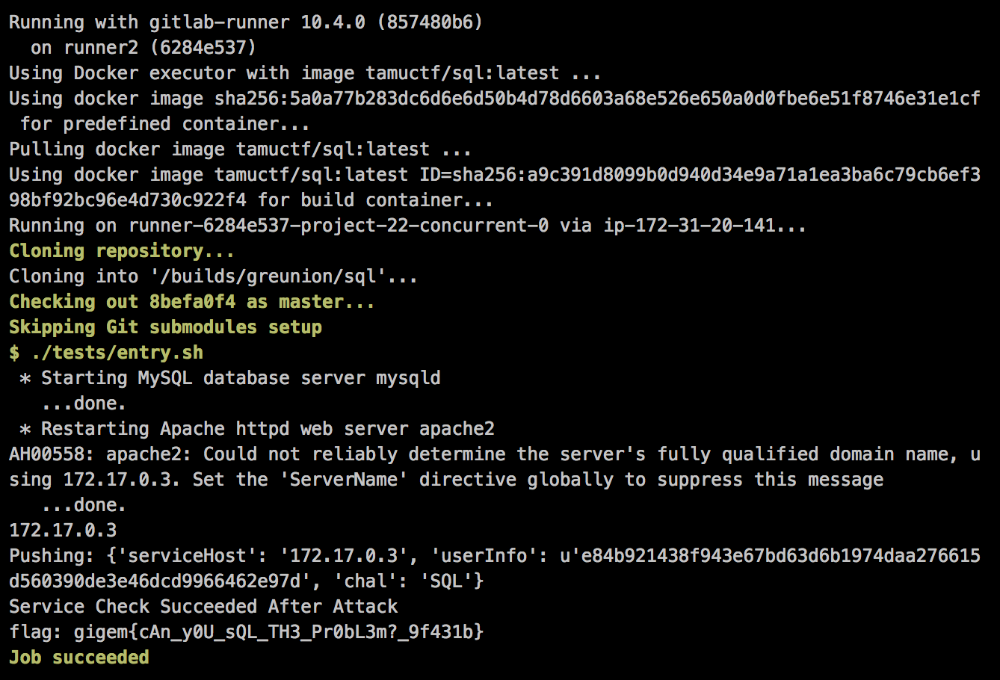

## sql (Secure Coding/Config, 50pt)

> I created a login form for my web page. Somehow people are logging in as admin without my password though!
> Can you fix my login code for me?
> 
> [](https://gitlab.ctf.tamu.edu/root/sql)

You can find the unpatched source code in the [sql](sql/) folder.


#### Vulnerability

SQL injection in login requests through unsanitized `$_POST` parameters.


#### Patch

Sanitization of user supplied `$_POST` values using `mysqli->real_escape_string()`.

```diff
diff --git a/login.php b/login.php
index 74a2ba9..0030350 100644
--- a/login.php
+++ b/login.php
@@ -13,8 +13,8 @@
         die("Connection failed: " . $conn->connect_error);
     // User and pass that were passed to us.
     // NOTE: The fact that the password is plaintext is not part of the challenge. It just makes testing much easie
-    $user = $_POST['username'];
-    $pass = $_POST['password'];
+    $user = $conn->real_escape_string($_POST['username']);
+    $pass = $conn->real_escape_string($_POST['password']);

     // Ensure admin will always be the first record, though really unnecessary
     $sql = "SELECT * FROM Users WHERE User='$user' AND Password='$pass' ORDER BY ID";
```


#### Flag


